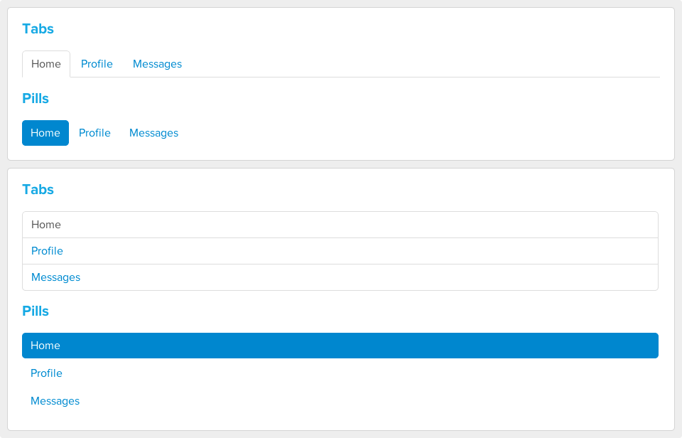
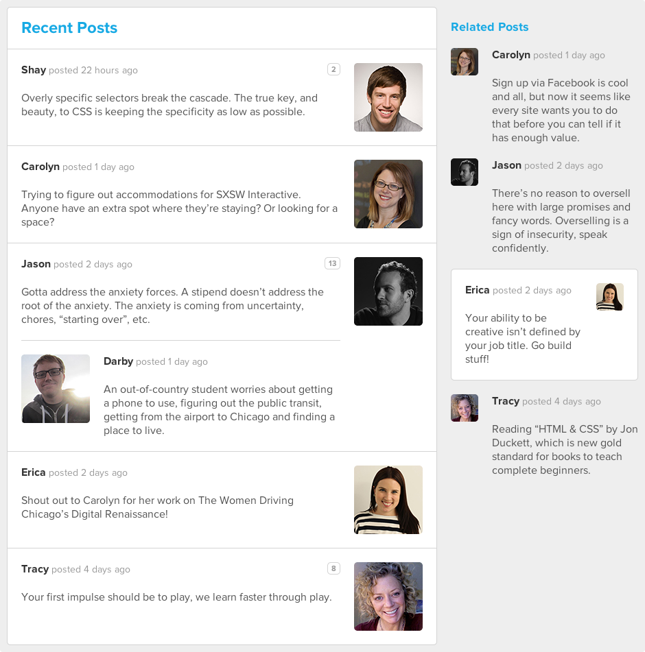

# Front End Legos Workshop

* [Presentation Slides](https://speakerdeck.com/shayhowe/front-end-legos-workshop-reusable-html-and-css)
* [Workshop Files](https://github.com/shayhowe/front-end-legos-workshop/blob/master/front-end-legos.zip?raw=true)

## #1 - Buttons

Using [01-buttons.html](https://github.com/shayhowe/front-end-legos-workshop/blob/master/01-buttons/01-buttons.html) and [01-buttons.css](https://github.com/shayhowe/front-end-legos-workshop/blob/master/01-buttons/01-buttons.css), complete the following:

**Step 1:**

* Create 5 different button styles, including:
 * `Default`, `Success`, `Warning`, `Danger`, `Boring`

**Step 2:**

* Create 4 different buttons sizes, including:
  * `Large`, `Small`, `Mini`

**Step 3:**

* Ensure the button styles that can be applied to any element, specifically including:
  * `a`, `button`, `input`, `span`, `div`

**Result:**

## #2 - Navigation

Using [02-navigation.html](https://github.com/shayhowe/front-end-legos-workshop/blob/master/02-navigation/02-navigation.html) and [02-navigation.css](https://github.com/shayhowe/front-end-legos-workshop/blob/master/02-navigation/02-navigation.css), complete the following:

**Step 1:**

* Create a horizontal tab style navigation using an unordered list

**Step 2:**

* Create a horizontal pill style navigation using an unordered list

**Step 3:**

* Using the existing horizontal tab and pill navigations, create vertical tab & pill style navigation alternates

**Result:**

## #3 - Media Object

Using [03-media-object.html](https://github.com/shayhowe/front-end-legos-workshop/blob/master/03-media-object/03-media-object.html) and [03-media-object.css](https://github.com/shayhowe/front-end-legos-workshop/blob/master/03-media-object/03-media-object.css), complete the following:

**Step 1:**

* Place a feed within primary & secondary columns
* Float images to the left & content to right
* Visually offset the primary feed
* Visually offset one unique item inside the secondary column

**Step 2:**

* Add borders around each primary item
* Add counts to a few primary items

**Step 3:**

* Reverse the position of images & content within the primary column, placing the images on the right and content on the left
* Leave any nested items within the primary column inversed, with images on the left and content on the right
* Reverse the position of images & content within any offset items in the secondary column, placing the images on the left and content on the right

**Result:**

